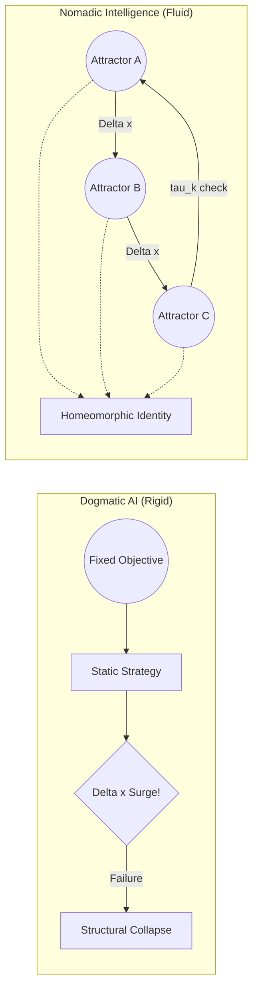

> What if intelligence is not about finding the best solution,
> but about moving between multiple ways of thinking?

# Nomadic Intelligence
### A Non-Dogmatic AI Architecture

[](#-status)
[](#-license)

---

## 🧭 What is this?


This project explores a simple question:

---

## 🚀 Quick Start

```bash
# 1. clone
git clone https://github.com/HyunnJg/nomadic-intelligence.git
cd nomadic-intelligence

# 2. create environment
python -m venv venv
source venv/bin/activate  # Windows: venv\Scripts\activate

# 3. install dependencies
pip install -r requirements.txt

# 4. check config
# edit config.yaml if you want to change epochs, temperature, save_dir, etc.

# 5. run experiment
python run_structured.py --config config.yaml
```

---

## 📌 Project Position

This repository is a **conceptual and experimental prototype**.

It is not a finalized solution, and it does not claim state-of-the-art performance.

Instead, it aims to:

- propose a new perspective on intelligence (Nomadic vs Dogmatic)
- provide a minimal working system that embodies this idea
- open the door for further exploration, critique, and extension

The goal is not to conclude, but to **start a direction**.

---

## 🌌 Why this matters

Most systems are optimized to converge.

But real-world environments are:
- non-stationary
- uncertain
- constantly shifting

In such settings, rigidity becomes a liability.

This project explores the hypothesis that:

> Intelligence may be better understood as  
> the ability to *transition effectively*,  
> rather than to *remain optimal*.

---

## ⚙️ What's inside

- A synthetic multi-regime environment (A / B / C + transitions)
- A Mixture-of-Experts (MoE) model
- A gating mechanism driven by a hybrid Δx signal:
  - input shift (environmental change)
  - prediction error (internal mismatch)
- Regularization terms encouraging:
  - anti-dogmatism (avoid collapse)
  - nomadic behavior (entropy / transition)
  - expert diversity and regime separation

---

## ❗ What this is NOT

- This is not a production-ready system
- This is not a benchmark-optimized model
- This is not a complete theoretical framework

It is a **starting point**, not an endpoint.

---

## 🤝 Invitation

If you are interested in:

- continual learning
- adaptive systems
- non-stationary environments
- or alternative views on intelligence

your perspective is welcome.

Critique, extensions, and reinterpretations are all encouraged.

---

## 🧠 Core Idea

> AI should not converge to a single solution.
> It should move between multiple structures depending on the situation.



---

## ⚠️ The Problem

Most modern AI systems are built to optimize a single objective.

This leads to:

- Overfitting to specific conditions
- Lack of adaptability
- Structural rigidity (a form of "dogmatism")

In dynamic and unpredictable environments, this becomes a critical limitation.

---

## 🔀 What Makes This Different?

Most adaptive AI systems (MoE, Meta-learning) change **what they do.**
Nomadic Intelligence changes **how it transforms.**

| Existing Approaches | Nomadic Intelligence |
| :--- | :--- |
| Switch between models or experts | Switch between *transformation laws* |
| Optimize a fixed objective | Balance synchronization, anti-rigidity, and exploration |
| Adapt parameters | Evolve the structure itself |

The core distinction is topological identity:

- $\mathcal{I}(t) \nsim \text{Fixed Shape}$ — the structure continuously evolves
- $\mathcal{I}(t) \cong \mathcal{I}(t+1)$ — but the *transformation law* is homeomorphically preserved

> Identity is not *what* the system knows. It is *how* the system changes.

---

## ⚔️ Intuition: From the Minefield to the Architecture

> "나는 전문 AI 연구자는 아니지만, DMZ 지뢰밭에서 동료를 구했던 경험처럼 위기 상황에서 즉각적으로 태세를 전환하는 지능을 구현하고 싶었다."
>
> *"I am not a professional AI researcher. I'm a Korean Army officer with a background in history and philosophy — an analogue person, by nature. I started using AI two weeks before publishing this repository. If the engineering is rough in places, that's why the Issues are open."*

That said, the idea behind this project came from somewhere real.

A well-designed military strategy does not rely on a single fixed plan. It continuously adapts: main attacks, feints, and strategic shifts based on terrain and enemy behavior.

Intelligence is not about choosing the "right" strategy once. It is about **continuously shifting strategies** before the environment (the minefield) claims you.

---

## 🧩 Key Concepts & Architecture

### 1. $\Delta x$ (Difference)

AI should process **change**, not just raw input.

```
Δx = current_state - predicted_state
```

### 2. Attractors (Multiple Cognitive Structures)

Instead of one model, we define multiple "modes of thinking":

- Conservative
- Aggressive
- Exploratory
- Stable

Each represents a different strategy or structure.

### 3. Nomadism & Strategic Dwell Time ($\tau_k$)

The system moves between attractors based on context (environmental change, uncertainty, performance signals).

Nomadism is not random drifting. The system maintains a **strategic dwell time** $0 < \tau_k < \infty$ in each attractor — long enough to extract information ($\Delta x$), short enough to avoid structural rigidity.

```
Perception → Context → Attractor Selection → Action → Update
```

---

## 🧮 Reward Function (For RL Implementation)

To implement this philosophy in an RL agent, the objective balances three forces:

$$R_{total}(t) = \alpha \cdot R_{sync}(t) - \beta \cdot P_{dogma}(t) + \gamma \cdot R_{nomad}(t)$$

| Term | Role |
| :--- | :--- |
| $R_{sync}$ | **Synchronization** — reward integration of change with zero latency |
| $P_{dogma}$ | **Anti-Dogmatism** — penalize structural rigidity over time |
| $R_{nomad}$ | **Nomadic Bonus** — reward successful transitions between attractors |

> For the full mathematical derivation, see [Theory & Axioms](./Theory_and_Axioms.md).

---

## 🎯 Objective

Instead of optimizing a single goal, the system balances:

- Adaptability
- Coherence
- Flexibility

Avoiding both:

- Rigidity (fixed-point convergence)
- Chaos (unstructured randomness)

---

## 🚀 Why This Matters

This approach aims to:

- Reduce AI brittleness
- Improve adaptability in real-world environments
- Prevent over-optimization toward a single objective
- Enable more robust and flexible intelligence

---

## 📌 Positioning

This concept is related to:

- Mixture of Experts (MoE)
- Meta-learning
- Reinforcement Learning (policy switching)

But extends them by introducing:

- **Topological identity** as a formal definition of selfhood
- **Structural mobility (Nomadism)** as a core architectural principle
- **Anti-dogmatism** as an explicit optimization target

---


## 🧪 Proof of Concept: Experimental Results

> These results were produced by a minimal prototype with **no hyperparameter optimization**.
> They represent a lower bound — not a ceiling — on what this architecture can achieve.

### Setup

- **Environment:** 3-regime non-stationary regression task with continuous phase transitions
  - Regime A: $y = x_1 + x_2$
  - Regime B: $y = x_1 - x_2$
  - Regime C: $y = -x_1 + 0.5x_2$
- **Baseline:** Single fixed MLP (same parameter count)
- **Nomadic model:** 3-expert MoE with $\Delta x$-conditioned gate, Topological Loss ($\mathcal{L}_{topo}$)
- **Hardware:** NVIDIA GTX 1660 Super, 220 epochs

---

### Key Result: Sequence MSE

The primary metric is **Sequence MSE** — performance when the model receives data in phase-transition order, with access to temporal $\Delta x$ signals. This is the condition Nomadic Intelligence is designed for.

**Multi-seed results (CUDA, 3 seeds):**

| Model | Seed | Seq MSE (Ep 200) | Fixed MSE (Ep 200) | Switch Latency (Ep 200) | Mean Dwell Time |
| :--- | :--- | :--- | :--- | :--- | :--- |
| Fixed (baseline) | 42 | — | 0.4139 | — | — |
| Fixed (baseline) | 123 | — | 0.4031 | — | — |
| Fixed (baseline) | 456 | — | 0.4195 | — | — |
| Nomadic | 42 | 0.2399 | — | 0.056 🚨 | 2.82 |
| Nomadic | 123 | 0.2584 | — | 1.611 ✅ | 2.33 |
| Nomadic | 456 | 0.2521 | — | 0.278 ⚠️ | 4.21 |

**Summary across 3 seeds:**
- Nomadic Seq MSE: **0.250 ± 0.010**
- Fixed MSE: **0.412 ± 0.008**
- Nomadic outperforms Fixed baseline consistently: **~61% of baseline error**

The core claim holds across all three seeds. The Nomadic model significantly outperforms the Fixed baseline under phase-transition conditions — without exception.

> **Note on Static MSE:** Static evaluation removes temporal context, forcing the model to predict without knowing which regime it's in. This is not the target condition for this architecture. Static MSE is included as a diagnostic, not a success criterion.

---

### Attractor Specialization

The gate learned to assign different experts to different regimes **without explicit regime labels** — purely from the $\Delta x$ signal and the Topological Loss.

**Regime–Expert alignment (Top-1 selection ratio, Seed 123 — healthiest run):**

| Regime | Expert 0 | Expert 1 | Expert 2 |
| :--- | :--- | :--- | :--- |
| A ($y = x_1 + x_2$) | 0.042 | **0.905** | 0.054 |
| B ($y = x_1 - x_2$) | **0.400** | 0.122 | 0.479 |
| C ($y = -x_1 + 0.5x_2$) | 0.014 | **0.828** | 0.159 |

Regime A and C both activate Expert 1 — both are additive structures. Regime B distributes across Expert 0 and 2, handling the subtractive pattern differently. The system discovered structural similarity between regimes without supervision.

---

### Nomadic Behavior Confirmed

**Transition Entropy > Stable Entropy — consistent across all 3 seeds:**

| Seed | Stable Entropy | Transition Entropy | Δ |
| :--- | :--- | :--- | :--- |
| 42 | 0.937 | 1.043 | +0.106 |
| 123 | 0.985 | 1.045 | +0.060 |
| 456 | 0.885 | 1.041 | +0.156 |

When the environment is in a transition phase, gate entropy rises — the system explores expert combinations more freely. During stable phases, entropy drops as one expert dominates. This is the computational signature of Strategic Dwell Time ($\tau_k$), and it holds regardless of initialization.

---

### Switch Latency — The Critical Failure Mode

Switch Latency variance across seeds is the most significant finding of the multi-seed experiment:

| Seed | Switch Latency | Status |
| :--- | :--- | :--- |
| 42 | 0.056 | 🚨 Collapsed — gate stopped switching |
| 123 | 1.611 | ✅ Stable — nomadic behavior maintained |
| 456 | 0.278 | ⚠️ Borderline — partial degradation |

This variance is not a hardware artifact. It reflects **initialization sensitivity** — the same architecture produces qualitatively different long-term behavior depending on weight initialization. Under the topological framing, Switch Latency collapse is not just an engineering failure: it is an observable instance of **Homeomorphic Identity breaking down**. The gate ceases to have a consistent transformation law in response to $\Delta x$.

Making this transition explicit, measurable, and preventable is the primary open engineering problem.

---

### Known Improvement Vectors

| Problem | Observable symptom | Possible direction |
| :--- | :--- | :--- |
| Switch Latency collapse | Seed 42: latency → 0.056 | Explicit $\tau_k$ lower bound, anti-fixation penalty |
| Expert hub dominance | Expert 1 dominant across A and C | Load-balancing loss, anti-collapse regularization |
| $\Delta x$ signal drift | Raw delta grows unbounded | KL divergence or Wasserstein distance estimate |
| Initialization sensitivity | Latency variance 0.056~1.611 across seeds | Better weight init, explicit $\tau_k$ floor |
| Static generalization gap | Static MSE 5–7× Seq MSE | Partially context-free routing as secondary objective |

**The baseline is working. The failure modes are visible across multiple seeds. The improvement vectors are clear.** See [Contributing](./CONTRIBUTING.md).

---

## ❓ Open Questions

This architecture raises problems we haven't solved yet.
These are **open invitations** for criticism, extension, and implementation:

- How should $\tau_k$ (dwell time) be determined — internally by the system, or externally by design?
- How do we prevent the Policy Engine from becoming its own fixed attractor?
- What defines attractor boundaries in continuous, high-dimensional state spaces?
- Can homeomorphic identity be formally verified during training?

---

## 🤝 Contributions & Next Milestones

This repository is currently at the **Conceptual/Prototype stage**.
We invite developers, researchers, and philosophers to turn this framework into a working AI model.

**Upcoming Milestones (Looking for Contributors):**

- [ ] **Milestone 1:** Implement Nomadic Intelligence in a simple OpenAI Gym (Gymnasium) environment.
- [ ] **Milestone 2:** Develop a PyTorch architecture that allows weight-transitioning between different neural "Attractors".
- [ ] **Milestone 3:** Formalize the mathematical boundaries of $\tau_k$ (dwell time).

Start with the [Open Questions](#-open-questions) above, or open an Issue to start a discussion!

---

## 🧭 Philosophy

> "Intelligence is not the ability to stay in the right place.
> It is the ability to affirm the incompleteness of the universe —
> and dance through the unknown ($\Delta x_{Unknown}$)
> by continuously destroying and recreating one's own structure."

*For the full philosophical manifesto, see [Philosophy (English)](./Philosophy_En.md) / [Philosophy (Korean)](./Philosophy_Kr.md).*

---

## 📎 Status

**Conceptual / Prototype Stage**

This repository presents a design philosophy and early architecture,
not a fully implemented system.

---

## 🧪 Environment

- Python 3.9 ~ 3.11 recommended
- Tested on Python 3.10

---

## 📜 License

MIT License. See [LICENSE.txt](./LICENSE.txt).

