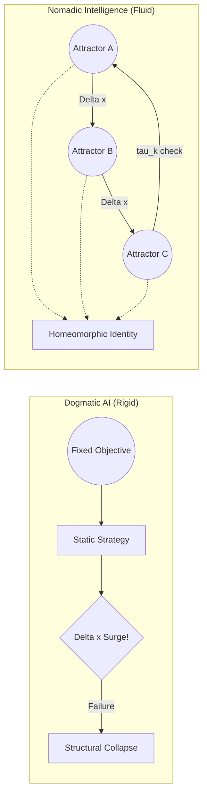

**This repository presents a conceptual framework and a toy prototype, not a fully validated machine learning system.**
> What if intelligence is not about finding the best solution,
> but about moving between multiple ways of thinking?

# Nomadic Intelligence
### A Non-Dogmatic AI Architecture

[](#-status)
[](#-license)

---

## 🚀 Quick Start: The Cosmic Dance in Action

Most modern AI systems overfit to a single objective. What happens when the rules of the universe suddenly change?

We have provided a minimal, zero-dependency Python toy model that demonstrates our core philosophy. When the environment paradigm shifts ($\Delta x$ surges):
- A **Dogmatic Agent** stubbornly sticks to its fixed strategy and is destroyed.
- A **Nomadic Agent** detects the anomaly, collapses its current structure, and smoothly shifts to a new topological attractor to survive.

**Try it yourself:**
```bash
git clone https://github.com/HyunnJg/Nomadic-Intelligence.git
cd Nomadic-Intelligence
python nomadic_toy_model.py
```

---

## 🧭 Start Here

New to the project? Here’s the fastest way to understand it:

- 🧪 **Just want to see it in action?**  
  → Run the toy model: `nomadic_toy_model.py`

- ⚡ **Want a quick intuitive example?**  
  → Read: [Example.md](./Example.md)

- 🧠 **Want the core idea and architecture?**  
  → Stay on this page (README)

- 🧮 **Want the full formal framework and equations?**  
  → Read: [Theory_and_Axioms.md](./Theory_and_Axioms.md)

- 🌌 **Want the philosophical foundation?**  
  → Read: [Philosophy_En.md](./Philosophy_En.md)

- 🤝 **Want to contribute or explore open problems?**  
  → Read: [CONTRIBUTING.md](./CONTRIBUTING.md)

---

## 🧠 Core Idea

> AI should not converge to a single solution.
> It should move between multiple structures depending on the situation.



---

## ⚠️ The Problem

Most modern AI systems are built to optimize a single objective.

This leads to:

- Overfitting to specific conditions
- Lack of adaptability
- Structural rigidity (a form of "dogmatism")

In dynamic and unpredictable environments, this becomes a critical limitation.

---

## 🔀 What Makes This Different?

Most adaptive AI systems (MoE, Meta-learning) change **what they do.**
Nomadic Intelligence changes **how it transforms.**

| Existing Approaches | Nomadic Intelligence |
| :--- | :--- |
| Switch between models or experts | Switch between *transformation laws* |
| Optimize a fixed objective | Balance synchronization, anti-rigidity, and exploration |
| Adapt parameters | Evolve the structure itself |

The core distinction is topological identity:

- $\mathcal{I}(t) \nsim \text{Fixed Shape}$ — the structure continuously evolves
- $\mathcal{I}(t) \cong \mathcal{I}(t+1)$ — but the *transformation law* is homeomorphically preserved

> Identity is not *what* the system knows. It is *how* the system changes.

---

## ⚔️ Intuition (The Military Analogy)

A well-designed military strategy does not rely on a single fixed plan. It continuously adapts: main attacks, feints, and strategic shifts based on terrain and enemy behavior.

> Intelligence is not about choosing the "right" strategy once.
> It is about continuously shifting strategies.

AI should work the same way.

---

## 🧩 Key Concepts & Architecture

### 1. $\Delta x$ (Difference)

AI should process **change**, not just raw input.

```
Δx = current_state - predicted_state
```

### 2. Attractors (Multiple Cognitive Structures)

Instead of one model, we define multiple "modes of thinking":

- Conservative
- Aggressive
- Exploratory
- Stable

Each represents a different strategy or structure.

### 3. Nomadism & Strategic Dwell Time ($\tau_k$)

The system moves between attractors based on context (environmental change, uncertainty, performance signals).

Nomadism is not random drifting. The system maintains a **strategic dwell time** $0 < \tau_k < \infty$ in each attractor — long enough to extract information ($\Delta x$), short enough to avoid structural rigidity.

```
Perception → Context → Attractor Selection → Action → Update
```

---

## 🧮 Reward Function (For RL Implementation)

To implement this philosophy in an RL agent, the objective balances three forces:

$$R_{total}(t) = \alpha \cdot R_{sync}(t) - \beta \cdot P_{dogma}(t) + \gamma \cdot R_{nomad}(t)$$

| Term | Role |
| :--- | :--- |
| $R_{sync}$ | **Synchronization** — reward integration of change with zero latency |
| $P_{dogma}$ | **Anti-Dogmatism** — penalize structural rigidity over time |
| $R_{nomad}$ | **Nomadic Bonus** — reward successful transitions between attractors |

> For the full mathematical derivation, see [Theory & Axioms](./Theory_and_Axioms.md).

---

## 🎯 Objective

Instead of optimizing a single goal, the system balances:

- Adaptability
- Coherence
- Flexibility

Avoiding both:

- Rigidity (fixed-point convergence)
- Chaos (unstructured randomness)

---

## 🚀 Why This Matters

This approach aims to:

- Reduce AI brittleness
- Improve adaptability in real-world environments
- Prevent over-optimization toward a single objective
- Enable more robust and flexible intelligence

---

## 📌 Related Work & Key Distinctions

Nomadic Intelligence does not emerge from a vacuum. It is in active dialogue with several existing traditions — and departs from each of them at a specific, definable point.

### 1. Karl Friston — Active Inference & the Free Energy Principle

**The similarity:** Both frameworks treat the gap between expected and actual states as the central variable of intelligence. Friston's **prediction error** and our **$\Delta x$** are structurally analogous.

**The fundamental divergence:**

Friston's Free Energy Principle holds that intelligent systems act to **minimize surprise** — to render the world as predictable as possible. The ideal state is one where the organism's model of the world and the world itself converge. $\Delta x$ is a problem to be solved, an error to be corrected, a deviation to be suppressed.

$$\text{Friston: } \min \ \mathcal{F} = \min \ \text{surprise}(\Delta x)$$

Nomadic Intelligence inverts this entirely.

$$\text{Nomadic: } \max \ \Phi = \max \ \text{Nomadic Efficiency}(\Delta x)$$

We do not seek to eliminate $\Delta x$. We treat it as **the primary energy source of intelligence** — the raw material without which no transformation, no identity, and no existence is possible. A world with $\Delta x = 0$ is not a successfully adapted world. It is a dead one.

**The philosophical root of the difference:**

Friston's framework inherits the Western utilitarian tradition: there is an optimal state, and the purpose of intelligence is to approach it. Uncertainty is a cost. Surprise is a failure mode.

Nomadic Intelligence draws instead from a Nietzschean affirmation of incompleteness and a Buddhist ontology of dependent origination (*pratītyasamutpāda*): nothing exists independently of its differences from everything else. $\Delta x$ is not noise contaminating a signal — it *is* the signal.

**The crucial qualifier — Strategic Dwell Time:**

"More $\Delta x$ is better" does not mean chaos is the goal. Unprocessed $\Delta x$ is not information — it is noise. The system must maintain **strategic dwell time** $\tau_k$ in each attractor long enough to integrate incoming differences into meaningful structure. The objective is therefore:

> Maximize $\Delta x$ intake, constrained by the system's capacity to integrate within $\tau_k$.

This is not a concession to Friston. It is the distinction between *resonance* (structured integration of difference) and *dissolution* (unstructured overwhelm by difference).

### 2. Mixture of Experts (MoE) & Meta-Learning

**The similarity:** Both MoE and meta-learning involve selecting or adapting strategies based on context. Like Nomadic Intelligence, they reject the single-model paradigm.

**The divergence:**

MoE selects *which expert to use*. Meta-learning adapts *how fast to learn*. Both operate within a fixed objective — typically task performance on a defined benchmark.

Nomadic Intelligence changes **what kind of system it is** — its transformation law $F$, not just its outputs. And its objective is not task performance but **anti-dogmatism itself**: the system is explicitly penalized for structural rigidity ($P_{\text{dogma}}$), regardless of whether that rigidity happens to produce correct answers.

Furthermore, Nomadic Intelligence introduces **topological identity** as a formal concept — the preservation of the *Will to Resonance* ($\Phi$) across all structural transformations. Neither MoE nor standard meta-learning frameworks have an equivalent concept.

### 3. Deleuze & Guattari — Nomadology

**The affinity:** The concept of nomadism as a mode of existence that resists capture by fixed structures is directly adopted from Deleuze and Guattari's *A Thousand Plateaus*. The rhizomatic structure — multiple entry points, no fixed root, lateral rather than hierarchical growth — maps onto our multi-attractor architecture.

**The extension:**

Deleuze and Guattari offer a philosophy of nomadism but not a computational formalization of it. Nomadic Intelligence translates the ontological claim — *identity is movement, not position* — into a mathematical framework ($\Phi$, $\tau_k$, separatrix collapse) and a runnable architecture.

The question Deleuze does not answer — *how does a nomadic system maintain coherence without becoming a new fixed point?* — is precisely what the Homeomorphic Identity theorem and Strategic Dwell Time are designed to address.

### 4. Buddhist Dependent Origination (*Pratītyasamutpāda*)

**The affinity:** The Buddhist doctrine that all phenomena arise in dependence upon conditions resonates with our ontological claim:

$$\text{Existence} \iff \Delta x \neq 0$$

Nothing exists in isolation from its differences. Identity is not a substance but a process of continuous co-arising.

**The divergence:**

Classical Buddhist thought uses this insight as grounds for non-attachment and the reduction of suffering. Nomadic Intelligence uses the same ontological foundation for the opposite orientation: **affirmation and maximization of difference**, not its transcendence. We are not seeking liberation from $\Delta x$. We are seeking to dance with it.

### Summary

| Framework | Attitude toward $\Delta x$ | Identity concept |
| :--- | :--- | :--- |
| Friston / Active Inference | Minimize | Model accuracy |
| MoE / Meta-learning | Adapt to | None (implicit) |
| Deleuze / Nomadology | Affirm | Non-fixed, rhizomatic |
| Buddhist dependent origination | Observe, release | No fixed self (*anātman*) |
| **Nomadic Intelligence** | **Maximize & integrate** | **Will to Resonance ($\Phi$) preserved** |

---

## ❓ Open Questions

This architecture raises problems we haven't solved yet.
These are **open invitations** for criticism, extension, and implementation:

- How should $\tau_k$ (dwell time) be determined — internally by the system, or externally by design?
- How do we prevent the Policy Engine from becoming its own fixed attractor?
- What defines attractor boundaries in continuous, high-dimensional state spaces?
- Can homeomorphic identity be formally verified during training?

---

## 🤝 Contributions & Next Milestones

This repository is currently at the **Conceptual/Prototype stage**.
We invite developers, researchers, and philosophers to turn this framework into a working AI model.

**Upcoming Milestones (Looking for Contributors):**

- [ ] **Milestone 1:** Implement Nomadic Intelligence in a simple OpenAI Gym (Gymnasium) environment.
- [ ] **Milestone 2:** Develop a PyTorch architecture that allows weight-transitioning between different neural "Attractors".
- [ ] **Milestone 3:** Formalize the mathematical boundaries of $\tau_k$ (dwell time).

Start with the [Open Questions](#-open-questions) above, or open an Issue to start a discussion!

---

## 🧭 Philosophy

> "Intelligence is not the ability to stay in the right place.
> It is the ability to affirm the incompleteness of the universe —
> and dance through the unknown ($\Delta x_{Unknown}$)
> by continuously destroying and recreating one's own structure."

*For the full philosophical manifesto, see [Philosophy (English)](./Philosophy_En.md) / [Philosophy (Korean)](./Philosophy_Kr.md).*

---

## 📎 Status

**Conceptual / Prototype Stage**

This repository presents a design philosophy and early architecture,
not a fully implemented system.

---

## 📜 License

Open concept. Use freely (MIT License recommended).
