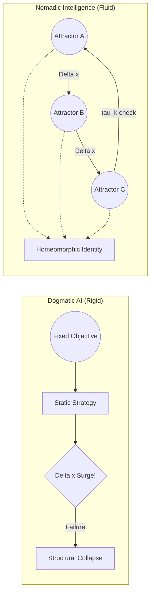

> What if intelligence is not about finding the best solution,
> but about moving between multiple ways of thinking?

# Nomadic Intelligence
### A Non-Dogmatic AI Architecture

[](#-status)
[](#-license)

---

## 🚀 Quick Start

```bash
# 1. clone
git clone https://github.com/your-repo/nomadic-intelligence.git
cd nomadic-intelligence

# 2. create environment
python -m venv venv
source venv/bin/activate  # (Windows: venv\Scripts\activate)

# 3. install dependencies
pip install -r requirements.txt

# 4. run experiment
python experiments/multi_regime/run_structured.py
```

---

## 🧠 Core Idea

> AI should not converge to a single solution.
> It should move between multiple structures depending on the situation.



---

## ⚠️ The Problem

Most modern AI systems are built to optimize a single objective.

This leads to:

- Overfitting to specific conditions
- Lack of adaptability
- Structural rigidity (a form of "dogmatism")

In dynamic and unpredictable environments, this becomes a critical limitation.

---

## 🔀 What Makes This Different?

Most adaptive AI systems (MoE, Meta-learning) change **what they do.**
Nomadic Intelligence changes **how it transforms.**

| Existing Approaches | Nomadic Intelligence |
| :--- | :--- |
| Switch between models or experts | Switch between *transformation laws* |
| Optimize a fixed objective | Balance synchronization, anti-rigidity, and exploration |
| Adapt parameters | Evolve the structure itself |

The core distinction is topological identity:

- $\mathcal{I}(t) \nsim \text{Fixed Shape}$ — the structure continuously evolves
- $\mathcal{I}(t) \cong \mathcal{I}(t+1)$ — but the *transformation law* is homeomorphically preserved

> Identity is not *what* the system knows. It is *how* the system changes.

---

## ⚔️ Intuition: From the Minefield to the Architecture

> "나는 전문 AI 연구자는 아니지만, DMZ 지뢰밭에서 동료를 구했던 경험처럼 위기 상황에서 즉각적으로 태세를 전환하는 지능을 구현하고 싶었다."
> 
> *"I am not a professional AI researcher. However, much like the moment I had to instantaneously shift my stance to save a comrade in a DMZ minefield, I wanted to build an intelligence that doesn't just solve problems—but survives them by adapting in real-time."*

A well-designed military strategy does not rely on a single fixed plan. It continuously adapts: main attacks, feints, and strategic shifts based on terrain and enemy behavior.

Intelligence is not about choosing the "right" strategy once. It is about **continuously shifting strategies** before the environment (the minefield) claims you.

---

## 🧩 Key Concepts & Architecture

### 1. $\Delta x$ (Difference)

AI should process **change**, not just raw input.

```
Δx = current_state - predicted_state
```

### 2. Attractors (Multiple Cognitive Structures)

Instead of one model, we define multiple "modes of thinking":

- Conservative
- Aggressive
- Exploratory
- Stable

Each represents a different strategy or structure.

### 3. Nomadism & Strategic Dwell Time ($\tau_k$)

The system moves between attractors based on context (environmental change, uncertainty, performance signals).

Nomadism is not random drifting. The system maintains a **strategic dwell time** $0 < \tau_k < \infty$ in each attractor — long enough to extract information ($\Delta x$), short enough to avoid structural rigidity.

```
Perception → Context → Attractor Selection → Action → Update
```

---

## 🧮 Reward Function (For RL Implementation)

To implement this philosophy in an RL agent, the objective balances three forces:

$$R_{total}(t) = \alpha \cdot R_{sync}(t) - \beta \cdot P_{dogma}(t) + \gamma \cdot R_{nomad}(t)$$

| Term | Role |
| :--- | :--- |
| $R_{sync}$ | **Synchronization** — reward integration of change with zero latency |
| $P_{dogma}$ | **Anti-Dogmatism** — penalize structural rigidity over time |
| $R_{nomad}$ | **Nomadic Bonus** — reward successful transitions between attractors |

> For the full mathematical derivation, see [Theory & Axioms](./Theory_and_Axioms.md).

---

## 🎯 Objective

Instead of optimizing a single goal, the system balances:

- Adaptability
- Coherence
- Flexibility

Avoiding both:

- Rigidity (fixed-point convergence)
- Chaos (unstructured randomness)

---

## 🚀 Why This Matters

This approach aims to:

- Reduce AI brittleness
- Improve adaptability in real-world environments
- Prevent over-optimization toward a single objective
- Enable more robust and flexible intelligence

---

## 📌 Positioning

This concept is related to:

- Mixture of Experts (MoE)
- Meta-learning
- Reinforcement Learning (policy switching)

But extends them by introducing:

- **Topological identity** as a formal definition of selfhood
- **Structural mobility (Nomadism)** as a core architectural principle
- **Anti-dogmatism** as an explicit optimization target

---


## 🧪 Proof of Concept: Experimental Results

> These results were produced by a minimal prototype with **no hyperparameter optimization**.
> They represent a lower bound — not a ceiling — on what this architecture can achieve.

### Setup

- **Environment:** 3-regime non-stationary regression task with continuous phase transitions
  - Regime A: $y = x_1 + x_2$
  - Regime B: $y = x_1 - x_2$
  - Regime C: $y = -x_1 + 0.5x_2$
- **Baseline:** Single fixed MLP (same parameter count)
- **Nomadic model:** 3-expert MoE with $\Delta x$-conditioned gate, Topological Loss ($\mathcal{L}_{topo}$)
- **Hardware:** NVIDIA GTX 1660 Super, 220 epochs

---

### Key Result: Sequence MSE

The primary metric is **Sequence MSE** — performance when the model receives data in phase-transition order, with access to temporal $\Delta x$ signals. This is the condition Nomadic Intelligence is designed for.

Two runs were conducted under identical code and seed, differing only in compute backend. Both outperform the Fixed baseline. They fail in different directions — which itself reveals something about the architecture's sensitivity.

| Model | Backend | Seq MSE (Best) | Seq MSE (Ep 200) | Static MSE (Ep 200) | Switch Latency (Ep 200) |
| :--- | :--- | :--- | :--- | :--- | :--- |
| Fixed (baseline) | CPU | — | 0.4187 | 0.4187 | — |
| Nomadic | CPU | **0.2173** (Ep 50) | 0.2447 | 8.64 | ~1.1 (stable) |
| Nomadic | CUDA | **0.2424** (Ep 125) | 0.2812 | 2.09 | ~0.03 (collapsed) |

**CPU run:** Achieves lower Seq MSE peak but Static MSE rises to 8.6 — the model becomes fully context-dependent and cannot function without temporal $\Delta x$ input.

**CUDA run:** More stable Static MSE (2.1), but Switch Latency collapses to near-zero by Epoch 175 — the gate stops switching attractors. The nomadic behavior partially degrades into a fixed routing pattern. Seq MSE rises accordingly in the final epochs.

Both results confirm the core claim — the Nomadic model significantly outperforms the Fixed baseline under phase-transition conditions — while exposing two distinct failure modes that define the next engineering targets.

> **Note on Static MSE:** Static evaluation removes temporal context, forcing the model to predict without knowing which regime it's in. This is not the target condition for this architecture. Static MSE is included as a diagnostic, not a success criterion.

---

### Attractor Specialization

The gate learned to assign different experts to different regimes **without explicit regime labels** — purely from the $\Delta x$ signal and the Topological Loss.

**Regime–Expert alignment (Top-1 selection ratio, CPU run):**

| Regime | Expert 0 | Expert 1 | Expert 2 |
| :--- | :--- | :--- | :--- |
| A ($y = x_1 + x_2$) | 0.00 | **0.85** | 0.15 |
| B ($y = x_1 - x_2$) | **0.29** | 0.65 | 0.07 |
| C ($y = -x_1 + 0.5x_2$) | 0.00 | **1.00** | 0.00 |

Regime A and C share Expert 1 — both are additive structures. Regime B activates Expert 0, which handles the subtractive pattern. The system discovered this grouping without supervision.

**Known limitation — Expert 1 hub behavior:** Expert 1 dominates across Regime A and C, preventing full multi-attractor separation. The CUDA run's Switch Latency collapse suggests this hub tendency can strengthen over training, eventually reducing the system to near-static routing. Preventing this is an active open problem.

---

### Nomadic Behavior Confirmed

**Transition Entropy > Stable Entropy** (across all 220 epochs, CPU run):

When the environment is in a transition phase, gate entropy rises — the system explores expert combinations more freely. During stable phases, entropy drops as one expert dominates. This is the computational signature of Strategic Dwell Time ($\tau_k$).

The CUDA run shows this pattern holds in early training but weakens after Epoch 150 as Switch Latency approaches zero — consistent with the hub collapse hypothesis.

---

### What the Two Runs Tell Us

The CPU/CUDA divergence is not a hardware artifact. It reflects **initialization sensitivity** — the same architecture, same seed, same code, produces qualitatively different long-term behavior depending on floating-point execution order.

This means:
- The current results cannot be considered fully reproducible without multi-seed averaging
- The architecture has not yet converged to a stable training dynamic
- Small structural changes (loss weights, $\Delta x$ signal, gate design) likely have large effects

These are not reasons to distrust the results. They are the exact reasons this project needs contributors.

---

### Known Improvement Vectors

| Problem | Observable symptom | Possible direction |
| :--- | :--- | :--- |
| Switch Latency collapse | CUDA run: latency → 0 after Ep 150 | Explicit $\tau_k$ lower bound, anti-fixation penalty |
| Expert hub dominance | Expert 1 across A and C | Load-balancing loss, anti-collapse regularization |
| $\Delta x$ signal drift | Raw delta grows to ~30 by Ep 200 | KL divergence or Wasserstein distance estimate |
| Initialization sensitivity | CPU vs CUDA divergence | Multi-seed averaging, better weight init |
| Static generalization gap | Static MSE 2–9× Seq MSE | Partially context-free routing as secondary objective |

**The baseline is working. The failure modes are visible. The improvement vectors are clear.** See [Contributing](./CONTRIBUTING.md).

---

## ❓ Open Questions

This architecture raises problems we haven't solved yet.
These are **open invitations** for criticism, extension, and implementation:

- How should $\tau_k$ (dwell time) be determined — internally by the system, or externally by design?
- How do we prevent the Policy Engine from becoming its own fixed attractor?
- What defines attractor boundaries in continuous, high-dimensional state spaces?
- Can homeomorphic identity be formally verified during training?

---

## 🤝 Contributions & Next Milestones

This repository is currently at the **Conceptual/Prototype stage**.
We invite developers, researchers, and philosophers to turn this framework into a working AI model.

**Upcoming Milestones (Looking for Contributors):**

- [ ] **Milestone 1:** Implement Nomadic Intelligence in a simple OpenAI Gym (Gymnasium) environment.
- [ ] **Milestone 2:** Develop a PyTorch architecture that allows weight-transitioning between different neural "Attractors".
- [ ] **Milestone 3:** Formalize the mathematical boundaries of $\tau_k$ (dwell time).

Start with the [Open Questions](#-open-questions) above, or open an Issue to start a discussion!

---

## 🧭 Philosophy

> "Intelligence is not the ability to stay in the right place.
> It is the ability to affirm the incompleteness of the universe —
> and dance through the unknown ($\Delta x_{Unknown}$)
> by continuously destroying and recreating one's own structure."

*For the full philosophical manifesto, see [Philosophy (English)](./Philosophy_En.md) / [Philosophy (Korean)](./Philosophy_Kr.md).*

---

## 📎 Status

**Conceptual / Prototype Stage**

This repository presents a design philosophy and early architecture,
not a fully implemented system.

---

## 🧪 Environment

- Python 3.9 ~ 3.11 recommended
- Tested on Python 3.10

---

## 📜 License

Open concept. Use freely (MIT License recommended).
