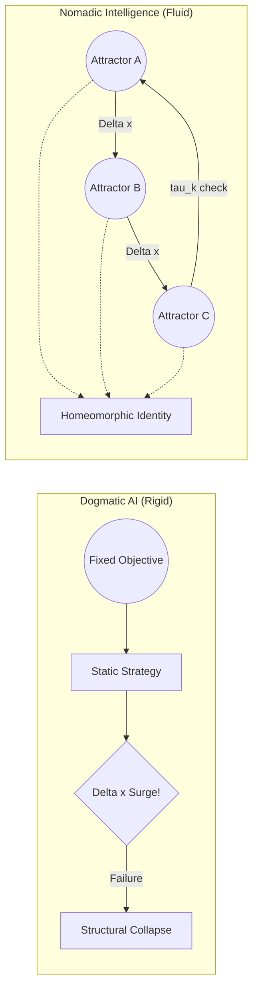

> What if intelligence is not about finding the best solution,
> but about moving between multiple ways of thinking?

# Nomadic Intelligence
### A Non-Dogmatic AI Architecture

[](#-status)
[](#-license)

---

## 🚀 Quick Start

```bash
# 1. clone
git clone https://github.com/your-repo/nomadic-intelligence.git
cd nomadic-intelligence

# 2. create environment
python -m venv venv
source venv/bin/activate  # (Windows: venv\Scripts\activate)

# 3. install dependencies
pip install -r requirements.txt

# 4. run experiment
python experiments/multi_regime/run_structured.py
```

---

## 🧠 Core Idea

> AI should not converge to a single solution.
> It should move between multiple structures depending on the situation.



---

## ⚠️ The Problem

Most modern AI systems are built to optimize a single objective.

This leads to:

- Overfitting to specific conditions
- Lack of adaptability
- Structural rigidity (a form of "dogmatism")

In dynamic and unpredictable environments, this becomes a critical limitation.

---

## 🔀 What Makes This Different?

Most adaptive AI systems (MoE, Meta-learning) change **what they do.**
Nomadic Intelligence changes **how it transforms.**

| Existing Approaches | Nomadic Intelligence |
| :--- | :--- |
| Switch between models or experts | Switch between *transformation laws* |
| Optimize a fixed objective | Balance synchronization, anti-rigidity, and exploration |
| Adapt parameters | Evolve the structure itself |

The core distinction is topological identity:

- $\mathcal{I}(t) \nsim \text{Fixed Shape}$ — the structure continuously evolves
- $\mathcal{I}(t) \cong \mathcal{I}(t+1)$ — but the *transformation law* is homeomorphically preserved

> Identity is not *what* the system knows. It is *how* the system changes.

---

## ⚔️ Intuition: From the Minefield to the Architecture

> "나는 전문 AI 연구자는 아니지만, DMZ 지뢰밭에서 동료를 구했던 경험처럼 위기 상황에서 즉각적으로 태세를 전환하는 지능을 구현하고 싶었다."
> 
> *"I am not a professional AI researcher. However, much like the moment I had to instantaneously shift my stance to save a comrade in a DMZ minefield, I wanted to build an intelligence that doesn't just solve problems—but survives them by adapting in real-time."*

A well-designed military strategy does not rely on a single fixed plan. It continuously adapts: main attacks, feints, and strategic shifts based on terrain and enemy behavior.

Intelligence is not about choosing the "right" strategy once. It is about **continuously shifting strategies** before the environment (the minefield) claims you.

---

## 🧩 Key Concepts & Architecture

### 1. $\Delta x$ (Difference)

AI should process **change**, not just raw input.

```
Δx = current_state - predicted_state
```

### 2. Attractors (Multiple Cognitive Structures)

Instead of one model, we define multiple "modes of thinking":

- Conservative
- Aggressive
- Exploratory
- Stable

Each represents a different strategy or structure.

### 3. Nomadism & Strategic Dwell Time ($\tau_k$)

The system moves between attractors based on context (environmental change, uncertainty, performance signals).

Nomadism is not random drifting. The system maintains a **strategic dwell time** $0 < \tau_k < \infty$ in each attractor — long enough to extract information ($\Delta x$), short enough to avoid structural rigidity.

```
Perception → Context → Attractor Selection → Action → Update
```

---

## 🧮 Reward Function (For RL Implementation)

To implement this philosophy in an RL agent, the objective balances three forces:

$$R_{total}(t) = \alpha \cdot R_{sync}(t) - \beta \cdot P_{dogma}(t) + \gamma \cdot R_{nomad}(t)$$

| Term | Role |
| :--- | :--- |
| $R_{sync}$ | **Synchronization** — reward integration of change with zero latency |
| $P_{dogma}$ | **Anti-Dogmatism** — penalize structural rigidity over time |
| $R_{nomad}$ | **Nomadic Bonus** — reward successful transitions between attractors |

> For the full mathematical derivation, see [Theory & Axioms](./Theory_and_Axioms.md).

---

## 🎯 Objective

Instead of optimizing a single goal, the system balances:

- Adaptability
- Coherence
- Flexibility

Avoiding both:

- Rigidity (fixed-point convergence)
- Chaos (unstructured randomness)

---

## 🚀 Why This Matters

This approach aims to:

- Reduce AI brittleness
- Improve adaptability in real-world environments
- Prevent over-optimization toward a single objective
- Enable more robust and flexible intelligence

---

## 📌 Positioning

This concept is related to:

- Mixture of Experts (MoE)
- Meta-learning
- Reinforcement Learning (policy switching)

But extends them by introducing:

- **Topological identity** as a formal definition of selfhood
- **Structural mobility (Nomadism)** as a core architectural principle
- **Anti-dogmatism** as an explicit optimization target

---


## 🧪 Proof of Concept: Experimental Results

> These results were produced by a minimal prototype with **no hyperparameter optimization**.
> They represent a lower bound — not a ceiling — on what this architecture can achieve.

### Setup

- **Environment:** 3-regime non-stationary regression task with continuous phase transitions
  - Regime A: $y = x_1 + x_2$
  - Regime B: $y = x_1 - x_2$
  - Regime C: $y = -x_1 + 0.5x_2$
- **Baseline:** Single fixed MLP (same parameter count)
- **Nomadic model:** 3-expert MoE with $\Delta x$-conditioned gate, Topological Loss ($\mathcal{L}_{topo}$)
- **Hardware:** NVIDIA GTX 1660 Super, 220 epochs

---

### Key Result: Sequence MSE

The primary metric is **Sequence MSE** — performance when the model receives data in phase-transition order, with access to temporal $\Delta x$ signals. This is the condition Nomadic Intelligence is designed for.

| Model | Test MSE (Epoch 50) | Test MSE (Epoch 200) |
| :--- | :--- | :--- |
| Fixed (baseline) | 0.4232 | 0.4187 |
| **Nomadic (sequence)** | **0.2173** | **0.2447** |

The Nomadic model converges to approximately **58% of the Fixed model's error** under phase-transition conditions. The Fixed model shows negligible improvement after epoch 50 — it has structurally saturated. The Nomadic model continues to adapt.

> **Note on Static MSE:** The Nomadic model's static test MSE rises significantly during training (reaching ~8.6 by epoch 200). This is expected and not a failure mode — when evaluated without temporal context, the model cannot determine which attractor to occupy. Static MSE is not the target metric for this architecture. See `Theory_and_Axioms.md` for the distinction between synchronization loss and static prediction accuracy.

---

### Attractor Specialization

The gate learned to assign different experts to different regimes **without explicit regime labels** — purely from the $\Delta x$ signal and the Topological Loss.

**Regime–Expert alignment (Top-1 selection ratio):**

| Regime | Expert 0 | Expert 1 | Expert 2 |
| :--- | :--- | :--- | :--- |
| A ($y = x_1 + x_2$) | 0.00 | **0.85** | 0.15 |
| B ($y = x_1 - x_2$) | **0.29** | 0.65 | 0.07 |
| C ($y = -x_1 + 0.5x_2$) | 0.00 | **1.00** | 0.00 |

Regime A and C share Expert 1 — both are additive structures. Regime B activates Expert 0, which handles the subtractive pattern. The system discovered this grouping without supervision.

The `regime_expert_alignment` plot confirms that when the dominant regime shifts, the dominant expert shifts in response — with a measurable transition latency ($\tau_k$) that grows as the gate becomes more decisive.

**Known limitation — Expert 1 hub behavior:** Expert 1 dominates across Regime A and C, functioning as a "hub" rather than a fully specialized attractor. True multi-attractor separation — where each regime maps cleanly to a distinct expert — has not yet been achieved. This is an active open problem. Possible directions: load-balancing loss, anti-collapse regularization, or stronger expert specialization incentives.

---

### Nomadic Behavior Confirmed

**Transition Entropy > Stable Entropy** (across all 220 epochs):

When the environment is in a transition phase, gate entropy rises — the system explores expert combinations more freely. During stable phases, entropy drops as one expert dominates. This is the computational signature of Strategic Dwell Time ($\tau_k$): the system is neither wandering randomly nor locked into a fixed structure.

---

### What Optimization Could Improve

This prototype used default hyperparameters with no tuning. Known improvement vectors:

- **$\tau_k$ formalization:** Dwell time is currently implicit. Explicit learnable dwell time would sharpen attractor boundaries.
- **$\Delta x$ estimation:** The hybrid delta signal grows unbounded during training (raw values reach ~30 by epoch 200). A more principled distributional distance measure (KL divergence, Wasserstein) would stabilize this.
- **Expert count scaling:** 3 experts for 3 regimes is a minimal setup. Scaling to more experts in higher-dimensional environments is the next test.
- **Continuous attractor boundaries:** The current architecture uses soft MoE routing. Formal attractor boundary detection (Challenge 2 in `Implementation_Draft.md`) would enable more precise Separatrix Collapse behavior.

**If you want to contribute to any of these — start here.** The baseline is working. The improvement vectors are clear. See [Contributing](./CONTRIBUTING.md).

---

## ❓ Open Problems

These are the live, unsolved problems in this project. Each one is an open invitation — for experiments, theory, visualization, or metric design. You don't need to understand everything to start somewhere.

**1. Expert Hub Collapse**
Expert 1 dominates across multiple regimes, preventing true multi-attractor structure. The system behaves as a soft nomad rather than a sharp one.
*Possible directions:* load-balancing loss, anti-collapse regularization, expert specialization incentives.

**2. Stable vs Transition Entropy Separation**
Gate entropy is currently high in both stable and transition phases. The goal is low entropy during stable regimes (committed to one attractor) and high entropy only during transitions (actively searching).
*Possible directions:* entropy penalty conditioned on detected regime stability.

**3. Formalizing $\tau_k$ (Dwell Time)**
Dwell time is currently implicit — the system exhibits it, but doesn't control it. Making $\tau_k$ explicit and learnable is the most tractable next engineering step.
*Possible directions:* Option-Critic architectures, learned threshold parameters, variance-based triggers.

**4. Regime–Expert Alignment Metrics**
Current alignment evidence is visual. A quantitative score would make the claim rigorous and reproducible.
*Possible directions:* mutual information between regime label and expert selection, conditional entropy, switching consistency ratio.

**5. Attractor Boundaries in Continuous State Spaces**
The prototype uses soft MoE routing as a proxy. Formally defining when a Separatrix Collapse has occurred — in continuous high-dimensional weight space — is an open mathematical problem.

**6. Formal Verification of Homeomorphic Identity**
The claim $\mathcal{I}(t) \cong \mathcal{I}(t+1)$ needs a measurable criterion. What observable property during training would confirm that the Will to Resonance ($\Phi$) is being preserved across structural transitions?

---

*We welcome small experiments, theoretical suggestions, visualization improvements, and metric design. See [CONTRIBUTING.md](./CONTRIBUTING.md) for where to start.*

---

## 🤝 Contributions & Next Milestones

This repository is currently at the **Conceptual/Prototype stage**.
We invite developers, researchers, and philosophers to turn this framework into a working AI model.

**Upcoming Milestones (Looking for Contributors):**

- [ ] **Milestone 1:** Implement Nomadic Intelligence in a simple OpenAI Gym (Gymnasium) environment.
- [ ] **Milestone 2:** Develop a PyTorch architecture that allows weight-transitioning between different neural "Attractors".
- [ ] **Milestone 3:** Formalize the mathematical boundaries of $\tau_k$ (dwell time).

Start with the [Open Questions](#-open-questions) above, or open an Issue to start a discussion!

---

## 🧭 Philosophy

> "Intelligence is not the ability to stay in the right place.
> It is the ability to affirm the incompleteness of the universe —
> and dance through the unknown ($\Delta x_{Unknown}$)
> by continuously destroying and recreating one's own structure."

*For the full philosophical manifesto, see [Philosophy (English)](./Philosophy_En.md) / [Philosophy (Korean)](./Philosophy_Kr.md).*

---

## 📎 Status

**Conceptual / Prototype Stage**

This repository presents a design philosophy and early architecture,
not a fully implemented system.

---

## 🧪 Environment

- Python 3.9 ~ 3.11 recommended
- Tested on Python 3.10

---

## 📜 License

Open concept. Use freely (MIT License recommended).
